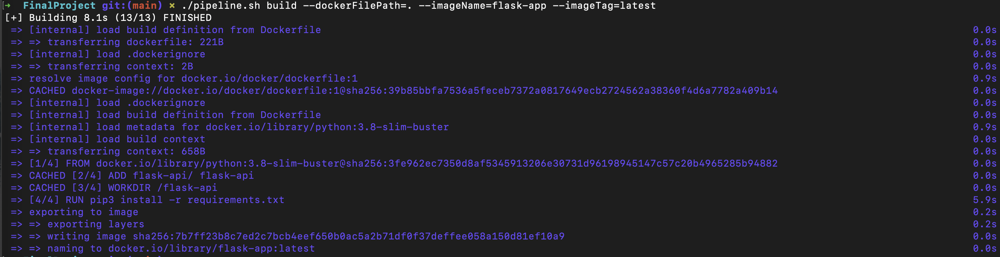
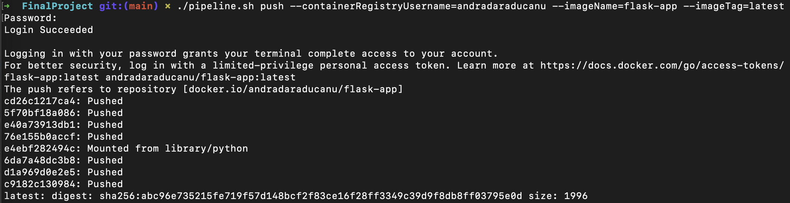
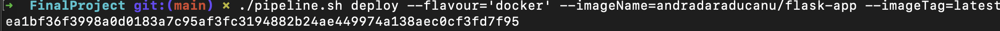
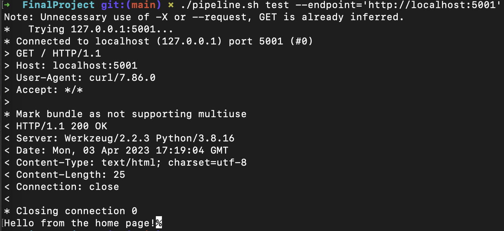
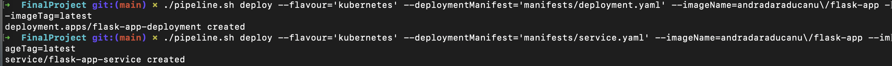

## Final project

During the last 10 lessons, you've learned about many technologies, and now it's time to put this knowledge to the test.
For this, you will be paired with another colleague to create a project that you will present in one week from now.

### Technologies

We expect you to use the following technologies:
- Git
- Bash
- Python Flask Framework
- Docker
- [Azure Cloud](Azure)

It's considered a bonus if you use the following:
- az CLI
- Kubernetes

### Description

#### Module 01: Application Development

1. Create a simple Flask application which:
   1. Makes a REST request to a public API and retrieves the response in a JSON format;
   2. Parses the JSON response;
   3. Implements an HTTP endpoint called /liveness.

2. Create a Dcokerfile which containes all the neccesarry instructions to run the application.

#### Module 02: CI/CD on local

- Create a Bash script which functions in the following way:
  1. `./pipeline.sh build <arg1> <arg2> ...`: builds the Docker image with the Flask application;
    
  2. `./pipeline.sh push <arg1> <arg2> ...`: pushes the created Docker image into a container registry;
    
  3. `./pipeline.sh deploy <arg1> <arg2> ...`: deploys a container with the Flask application on your local machine using Docker;
    
  4. `./pipeline.sh test <arg1> <arg2> ...`: sends a curl request to the liveness endpoint and expects a 200 response.  
    
  > **BONUS**  
  > 5. `./pipeline.sh deploy <arg1> <arg2> ...`: creates a Kubernetes deployment with the Flask application in a Kubernetes cluster deployed on your local machine.
  > 

#### Module 03: CI/CD in the Cloud

- Create an Azure DevOps pipeline which:
  1. Builds the Docker image with the Flask application;
  2. Pushes the created Docker image into a [container registry](#crs);
  3. Deploys a [container](#container) with the Flask application;
  4. Sends a curl request to the liveness endpoint and expects a [200 response](#response).  
  > **BONUS**  
  > 5. Creates a Kubernetes deployment with the Flask application in a [Kubernetes](#kubernetes) cluster

#### **Azure**
You should already have an Azure DevOps organization created with 1 free parallel jobs. Using the same account, you can activate the free tier for [Azure Cloud](https://signup.azure.com/)
> The sign up proccess requires you to put in a credit card credentials; for this, Revolut is listed as a pre-payed card so will not be able to use this one.

#### **CRs**
You can push to your account in Docker Hub or you can make use of Azure Container Registry service in Azure. We encourage you to use the second one.

#### **Container**
You can do the deployment in one of the following:
- create a Virtual Machine in Azure, install Docker on it, connect to it **via the pipeline** and run the container with the Docker image there;
- **via the pipeline**, using az CLI commands, create a Container Instance and run the container with the Docker image there; pay close attention to this as you will need to authenticate to the Azure Container Registries with access keys; a best practice is to store those into another object called **Key Vault**.

#### **Response**
This must be done from the pipeline, you will be using conditions; the pipeline doesn't finish succesfully if this test fails.

#### **Kubernetes**
You can use Azure Kubernetes Service to deploy a Kubernetes cluster and deploy the Flask application there. Pay attention here as we advice to use the kubeconfig file to create the connection from Azure Kubernetes Service into Azure DevOps.
